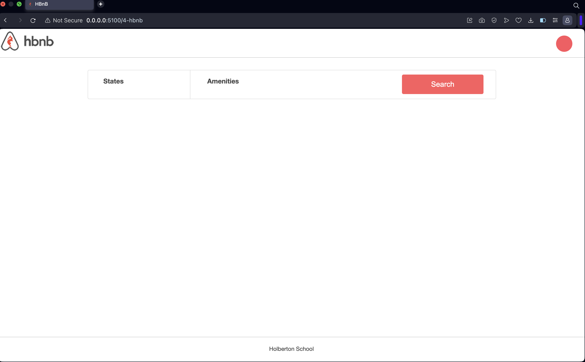
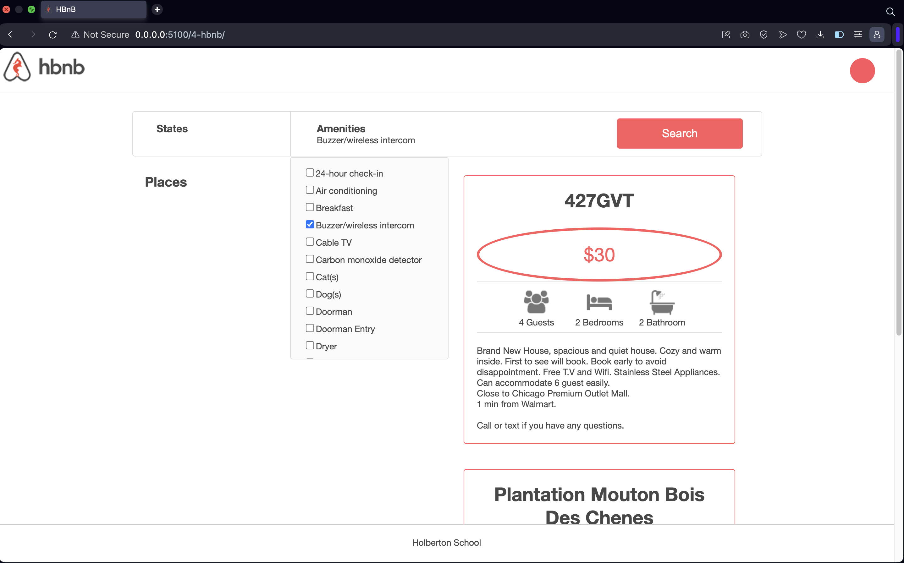

# Airbnb Clone - Web dynamic

## Overview 
This part of the Airbnb clone project focuses on adding dynamic functionality using JavaScript. We enhance the web interface to allow users to filter amenities and fetch related places when the search button is pressed.

## Features

- Dynamic filtering of places based on selected amenities.
- Real-time status check of the backend API.
- Interactive UI with checkboxes for selecting amenities.
- Places information dynamically fetched and displayed upon search.

## Screenshots

## Authors

Aydan Jafarli <aydan.jafarli@holbertonstudents.com>

Ziyad Ibrahimov <ziyad.ibrahimov@holbertonstudents.com>
